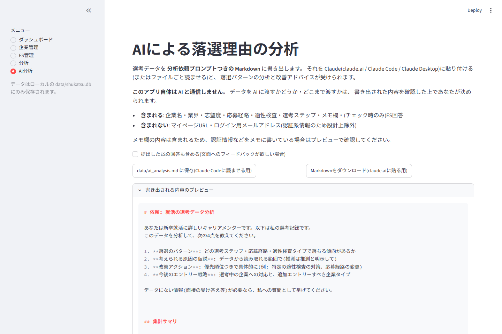

# shukatsu-tracker

[](https://github.com/Natto2026/shukatsu-tracker/actions/workflows/ci.yml)


就活の選考状況をローカルで一元管理し、**「どこで・なぜ落ちているか」を振り返れる**分析機能つきの管理ツールです。


## なぜ作ったか

就活の企業管理はスプレッドシートが定番ですが、実際に使っていて次の課題がありました。

- 締切の見落としが怖い(マイページごとに情報が分散し、一覧性がない)
- ESの回答を使い回したいのに、過去の回答を探すのに時間がかかる
- 落選が続いたとき、**「文面が悪いのか、応募経路や適性検査で落ちているのか」が分からない**

特に3つ目は自分の就活で痛感した点です。同じ実力でも、スカウト経由とナビサイトの一般公募では通過率がまったく違いました。このツールは記録だけでなく「応募経路別・適性検査タイプ別の通過率」を可視化し、戦略の振り返りまでを目的にしています。

## 機能

| ページ | 内容 |
|---|---|
| ダッシュボード | 7日以内の締切アラート(期限超過は強調表示)、全社の選考状況一覧 |
| 企業管理 | 企業ごとの選考ステップ(ES〜最終面接+自由追加)、締切・結果の記録、マイページURL管理、企業研究リンクの自動生成(公式・事業内容・IR・クチコミ・選考体験記) |
| ES管理 | 設問・回答のライブラリ化。カテゴリ/キーワード検索、文字数制限との照合(超過警告) |
| 分析 | 応募経路別・適性検査タイプ別の通過率、選考ファネル(どのステップで落ちているか) |
| AI分析 | 選考データを分析依頼プロンプトつき Markdown に書き出し、Claude 等の AI に渡して落選パターンの分析を受けられる。**アプリ自体は AI と通信せず**、何をどこまで AI に渡すかはユーザーが書き出し内容を確認して決められる |

### 選考の振り返り分析

応募経路別・適性検査タイプ別の通過率と、選考ファネルを可視化します。


### 企業管理と AI 分析

 

## セットアップ

```bash
git clone https://github.com/Natto2026/shukatsu-tracker.git
cd shukatsu-tracker
pip install -e ".[dev]"
streamlit run app.py
```

ブラウザで http://localhost:8501 が開きます。

**デモデータで試す**(スクリーンショットと同じ架空データ):

```powershell
python scripts/demo_data.py
$env:SHUKATSU_DB="data/demo.db"; streamlit run app.py
```

## データの扱い(セキュリティ方針)

- データはローカルの `data/shukatsu.db`(SQLite)にのみ保存され、外部送信は一切ありません
- サーバーは `127.0.0.1` のみにバインドし、同一LAN内の他端末からもアクセスできない設定です(`.streamlit/config.toml`)
- `data/` は `.gitignore` 済みで、個人の選考データがリポジトリに混入しない構成です
- **パスワードは保存しない設計**です(平文保存は漏洩リスクになるため、マイページURLと登録メールアドレスのみ管理します)

## 技術構成

- **Python 3.10+ / Streamlit / SQLite**(標準ライブラリの sqlite3)
- 集計ロジック(`shukatsu_tracker/analytics.py`)は DB に依存しない純粋関数として分離し、単体テスト可能にしています
- テストは pytest によるロジック単体テスト+ Streamlit AppTest の画面スモークテストで担保し、CI(lint + テスト)で常時実行しています(件数は CI のログ参照)

```bash
python -m pytest
```

## 構成

```
shukatsu-tracker/
├── app.py                  # Streamlit UI
├── shukatsu_tracker/
│   ├── constants.py        # 応募経路・選考ステップ等の定義
│   ├── db.py               # SQLite 読み書き
│   ├── analytics.py        # 締切抽出・通過率・ファネル集計(純粋関数)
│   ├── research.py         # 企業研究リンク生成
│   └── ai_export.py        # AI 分析用 Markdown 書き出し
└── tests/                  # pytest(ロジック + AppTest スモーク)
```

設計の詳細は [docs/architecture.md](docs/architecture.md)(レイヤー設計・設計原則)と
[docs/data_flow.md](docs/data_flow.md)(データの流れ・テーブル設計)を参照。
開発規約は [CONTRIBUTING.md](CONTRIBUTING.md) にまとめています。
