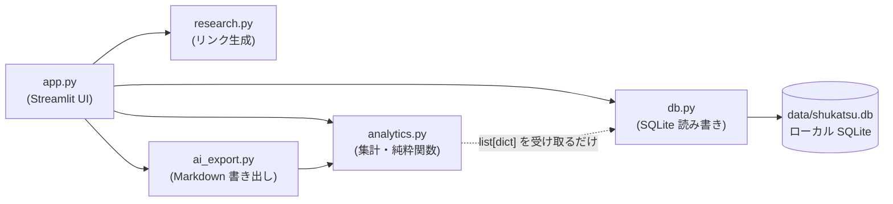

# アーキテクチャ

## 構成

```
shukatsu-tracker/
├── app.py                    # Streamlit UI(画面の組み立てのみ。ロジックは持たない)
├── src/
│   └── shukatsu_tracker/
│       ├── constants.py      # 選択肢の定義(応募経路・選考ステップ等)
│       ├── db.py             # SQLite 読み書き(唯一 DB に触る層)
│       ├── analytics.py      # 集計ロジック(DB 非依存の純粋関数)
│       ├── research.py       # 企業研究リンク生成(通信しない。URL 組み立てのみ)
│       └── ai_export.py      # AI 分析用 Markdown 書き出し(通信しない)
├── scripts/demo_data.py      # デモデータ生成(架空企業)
├── tests/                    # 単体テスト + AppTest 画面スモークテスト
└── docs/                     # 設計文書(このフォルダ)
```

src レイアウト採用の理由: 「インストールされたパッケージ」と「リポジトリ直下の雑多なファイル」を
物理的に分離し、テストが必ずインストール済みパッケージに対して走るようにするため。

## レイヤー設計



- **UI とロジックの分離** — `app.py` は表示と入力の受け付けだけを行い、計算はすべて
  `shukatsu_tracker/` 側に置く。画面を変えてもロジックのテストが壊れない
- **analytics は純粋関数** — DB コネクションを受け取らず、`db.list_steps()` が返す
  `list[dict]` だけを入力にする。テストがデータ組み立てだけで書ける
- **DB に触るのは db.py だけ** — SQL が散らばらない。スキーマ変更時の影響範囲が一目で分かる

## 設計原則

1. **ローカル完結** — データは `data/*.db` のみ。外部送信ゼロ。サーバーは 127.0.0.1 バインド
2. **認証情報を持たない** — パスワードは保存しない。マイページ URL・ログイン用メールは
   保存するが AI 書き出しには含めない(回帰テストで保証)
3. **AI とはファイルで会話する** — アプリは AI と通信せず、分析用 Markdown を書き出すだけ。
   何を AI に渡すかの判断をユーザーの手に残す
4. **数字を文書にハードコードしない** — テスト件数などは CI ログを正とする
   (文書内の数字はすぐ古くなるため)
5. **個人データをリポジトリに入れない** — `data/` は .gitignore。スクリーンショットも
   架空企業のデモデータで撮る

## 開発フロー

Issue 起点 → `feature/xxx` または `fix/xxx` ブランチ → ruff + pytest をローカルで通す →
Pull Request(CI: lint + test 3.11/3.13)→ マージ → ブランチ削除。
節目で CHANGELOG を更新し、セマンティックバージョニングでタグ+リリースを切る。
