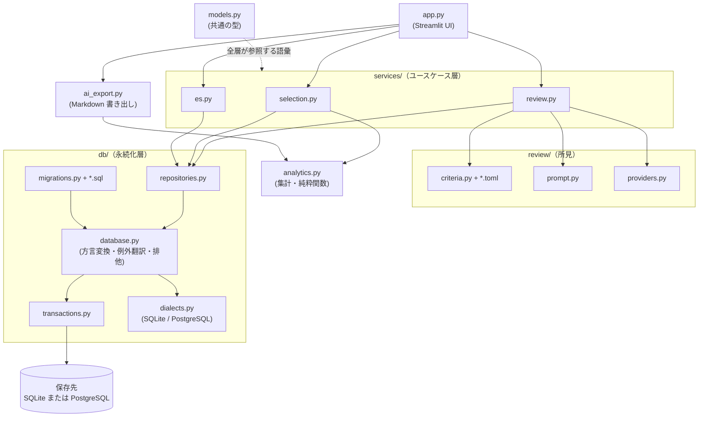

# アーキテクチャ

## 構成

```
shukatsu-tracker/
├── app.py                        # Streamlit UI（画面の組み立てのみ。ロジックは持たない）
├── src/
│   └── shukatsu_tracker/
│       ├── models.py             # 層をまたいで受け渡す型（dataclass）
│       ├── constants.py          # 選択肢の定義（応募経路・選考ステップ等）
│       ├── analytics.py          # 集計ロジック（DB 非依存の純粋関数）
│       ├── research.py           # 企業研究リンク生成（通信しない。URL 組み立てのみ）
│       ├── ai_export.py          # 分析用 Markdown 書き出し（通信しない）
│       ├── db/                   # 永続化層
│       │   ├── connection.py     # 接続（この層だけが接続を作る）
│       │   ├── database.py       # 接続の薄い包み（方言変換・例外翻訳・排他）
│       │   ├── dialects.py       # DBMS ごとの差分（SQLite / PostgreSQL）
│       │   ├── errors.py         # 共通の例外（ドライバ固有の型を外に出さない）
│       │   ├── transactions.py   # トランザクション境界
│       │   ├── migrations.py     # スキーマのバージョン適用
│       │   ├── migrations/*.sql  # スキーマ本体（連番。追記のみ。方言共通）
│       │   └── repositories.py   # テーブルごとの読み書き（SQL を書く唯一の場所）
│       ├── review/               # 回答への所見
│       │   ├── criteria.py       # 観点の読み込みと業界ごとの合成
│       │   ├── criteria/*.toml   # 観点の定義（データ。コード変更なしで追記できる）
│       │   ├── prompt.py         # 依頼文の組み立て
│       │   └── providers.py      # 実行先（既定は通信しない書き出しのみ）
│       └── services/             # ユースケース層（UI が呼ぶ入口）
│           ├── selection.py      # 企業・選考ステップの操作と集計の取りまとめ
│           ├── es.py             # 設問・回答の保存と検索
│           └── review.py         # 所見を取る順序の固定と履歴の保存
├── scripts/demo_data.py          # デモデータ生成（架空企業）
├── docker-compose.yml            # PostgreSQL を手元で試す場合の構成（既定では不要）
├── tests/                        # 層ごとの単体テスト + AppTest による画面のテスト
└── docs/                         # 設計文書（このフォルダ）
```

src レイアウト採用の理由: 「インストールされたパッケージ」と「リポジトリ直下の雑多なファイル」を
物理的に分離し、テストが必ずインストール済みパッケージに対して走るようにするため。

## レイヤー設計



上の層は下の層だけを呼ぶ。逆向きの依存はない。

| 層 | 責務 | してはいけないこと |
|---|---|---|
| `app.py` | 入力を受け取り、サービスを呼び、結果を並べる | 集計・SQL を書く |
| `services/` | 業務ルール（既定ステップの一括登録、入力の検証、トランザクションの単位） | SQL を書く、Streamlit に触る |
| `db/repositories.py` | テーブルごとの読み書き、行とモデルの変換 | 業務ルールを持つ |
| `analytics.py` | 集計。入力は `StepView` の列だけ | DB・UI に触れる |
| `db/database.py` | 方言の変換、例外の翻訳、書き込みの直列化 | テーブルごとの事情を持つ |
| `review/` | 観点の読み込み、依頼文の組み立て、実行先の抽象化 | DB に触れる、実行先を勝手に選ぶ |

## 画面の方針

- **描画で書き込まない。** 保存は利用者が押したときだけ行う。開いただけで保存が
  走る作りは、別のタブや端末で更新された内容を古い表示のまま上書きする。
- **入力欄の key に保存済みの値を含める。** Streamlit は key を持つウィジェットの
  値をセッションに残すため、DB が変わっても古い値が残り続ける。key を値に連動
  させると、更新があったときに入力欄が作り直される。
- **保存時にも突き合わせる。** 表示した時点の値と現在の値がずれていれば、その行は
  書かずに利用者へ知らせる。
- **利用者の入力を Markdown として解釈しない。** 企業名・メモ・URL は表示前に
  エスケープする。URL は scheme を確認してからリンクにする。
- **破壊的な操作には確認を挟む。** 何が失われるかを書いたうえで、確認してから実行する。

## 設計原則

1. **ローカル完結（既定）** — 既定の保存先は `data/*.db` のみ。外部送信ゼロ。
   サーバーは 127.0.0.1 バインド。PostgreSQL を別ホストに向けた場合はこの前提が変わる
2. **認証情報を持たない** — パスワードは保存しない。マイページ URL・ログイン用メールは
   保存するが書き出しには含めない（回帰テストで保証）
3. **外部とはファイルで受け渡す** — アプリは通信せず Markdown を書き出すだけ。
   何をどこまで渡すかの判断を利用者の手に残す
4. **数字を文書にハードコードしない** — テスト件数などは CI ログを正とする
5. **個人データをリポジトリに入れない** — `data/` は .gitignore。スクリーンショットも
   架空企業のデモデータで撮る

## 所見の方針

- **観点はコードではなくデータで持つ。** 書き方の基準は見直しが入るため、
  `review/criteria/*.toml` を編集すれば増減できる。共通の観点に業界ごとの
  上乗せを重ね、`emphasis` に共通観点の id を並べると重みが上がる。
  これは一般的な書き方の整理であり、特定の組織の基準として提示しない
  （その旨をテストで検証している）。
- **実行先は差し替えられる。** `ReviewProvider` は「依頼文を受け取り所見を返す」
  だけの形にしてあり、既定の実装は通信しない。通信する実装を足しても、
  外部に出すかどうかを利用者が選ぶ前提が崩れない。
- **認証情報は持たない。** API キーはアプリで受け取らず保存もしない。
  SDK が実行環境の環境変数から解決したものを使う。
- **送る前に見せる。** 組み立てた依頼文は実行前に画面へ出す。
  何を渡すことになるのかが見えないまま送信されない。
- **評価した時点の本文を控える。** 回答は後から書き換わるため、
  所見と対応する文面を `answer_snapshot` に残す。

## 永続化の方針

- **スキーマは SQL ファイルで管理する。** `db/migrations/NNN_name.sql` を追加すると、
  次回の接続時に未適用のものだけが順に流れ、`schema_migrations` テーブルに記録される。
  既存の DB を作り直さずに列やテーブルを足せる。適用済みのファイルは変更しない（追記のみ）。
- **トランザクションは明示的に開き、境界の間はロックを握る。** ドライバ既定の
  暗黙トランザクションは DDL をコミットしてしまい「まとめて成功するか、まとめて
  失敗するか」を保証できないため、自動トランザクションを切り、
  `transactions.transaction()` だけが BEGIN / COMMIT を発行する。
  入れ子かどうかは接続の状態ではなくこの層が数える深さで判定する。接続の状態で
  判定すると、別スレッドが開けたトランザクションを自分のものと誤認し、相手の
  ROLLBACK で自分の書き込みが消える。
- **更新できる列は列挙する。** 列名はプレースホルダに置けないため、リポジトリごとに
  `writable` を持ち、そこにない列が渡されたら SQL に届く前に `ValueError` にする。
- **DB は差し替えられる。** SQLite と PostgreSQL に対応する。SQL は1組のまま、
  方言の差（プレースホルダ・主キーの書き方・日付関数・例外の型）は `dialects.py`
  に閉じる。マイグレーションの SQL では `{{PK}}` などの差し込み記号で吸収する。
  同じテスト一式を両方の DBMS に対して CI で走らせ、差分の抜けを検出する。
- **ドライバの例外を外に出さない。** 一意制約違反などは `errors.py` の共通の型に
  翻訳する。DB を替えても、サービス層と画面のエラー処理を書き換えずに済む。

## 開発フロー

Issue 起点 → `feature/xxx` または `fix/xxx` ブランチ → ruff + pytest をローカルで通す →
Pull Request（CI: lint、SQLite で 3.11/3.13、実際の PostgreSQL で同じテスト一式）
→ マージ → ブランチ削除。
節目で CHANGELOG を更新し、セマンティックバージョニングでタグ+リリースを切る。
