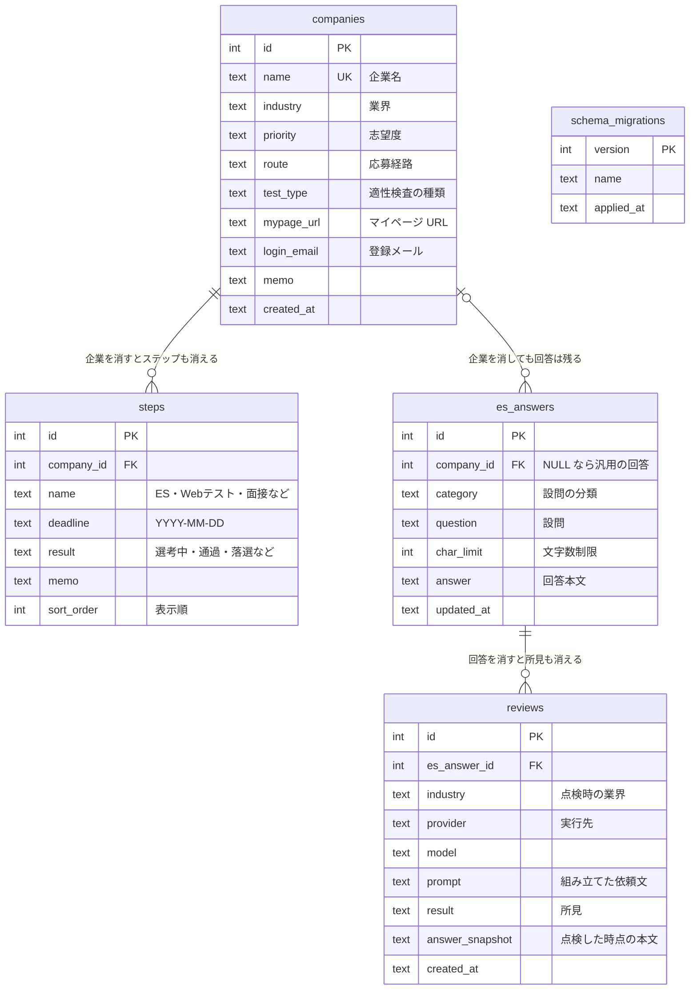

# データフロー

ユーザー操作からデータがどこへ流れ、どこへ流れないかの全体図。

```
ユーザー入力（企業・選考ステップ・設問と回答）
      │
      ▼
┌─────────────────────────┐
│ app.py（Streamlit UI）  │  入力を受け取るだけ
└──────────┬──────────────┘
           │ services/ の公開メソッドを呼ぶ
           ▼
┌─────────────────────────┐
│ services/               │  入力の検証・業務ルール・トランザクションの単位
└──────────┬──────────────┘
           │ repositories 経由の読み書き
           ▼
   保存先（既定: ローカル SQLite。PostgreSQL にも切り替え可）
           │
           │ StepView の列
           ▼
┌─────────────────────────┐
│ analytics.py            │ 締切抽出 / 通過率 / ファネル / 状況ラベル
└──────────┬──────────────┘
           ├─► 画面表示（ダッシュボード・分析ページ）
           │
           ▼
┌─────────────────────────┐
│ ai_export.py            │ 依頼文つき Markdown
└──────────┬──────────────┘
           ▼
   data/ai_analysis.md（利用者が内容を確認してから渡す）
   ※ マイページURL・ログイン用メールは含まれない（回帰テストで保証）
```

## テーブル設計

| テーブル | 役割 | 備考 |
|---|---|---|
| `companies` | 企業マスタ | 企業名は UNIQUE。パスワード列は意図的に持たない |
| `steps` | 選考ステップ（企業:ステップ = 1:N） | 企業削除で連動削除（CASCADE） |
| `es_answers` | 設問・回答（企業に紐付くか汎用） | 企業を削除しても回答は残す（SET NULL）。書いた文章は資産のため |
| `reviews` | 回答への所見の履歴 | 評価時点の本文を控える。回答削除で連動削除（CASCADE） |
| `schema_migrations` | 適用済みスキーマの記録 | `db/migrations/*.sql` の版管理に使う |

### ER 図



パスワード列がどこにもないのは設計上の意図（[README のセキュリティ方針](../README.md#データの扱いセキュリティ方針)）。
`reviews.answer_snapshot` を持つのは、回答が後から書き換わっても「どの文面への所見か」を辿れるようにするため。

### 索引

| 索引 | 列 | 使う場面 |
|---|---|---|
| `idx_steps_company` | `steps(company_id, sort_order, id)` | 企業ごとのステップ一覧（表示順つき） |
| `idx_steps_deadline` | `steps(deadline)`、NULL を除く | ダッシュボードの締切一覧 |
| `idx_es_answers_company` | `es_answers(company_id)` | 企業に紐付く回答の一覧 |
| `idx_reviews_answer` | `reviews(es_answer_id, id DESC)` | 回答ごとの所見履歴（新しい順） |

## 型の流れ

| 型 | 生まれる場所 | 使う場所 |
|---|---|---|
| `Company` / `Step` / `EsAnswer` | UI の入力、リポジトリの読み出し | 保存・表示 |
| `StepView` | `StepRepository.list_views()`（企業情報を結合） | 集計の唯一の入力 |
| `Deadline` / `PassRate` / `FunnelRow` | `analytics.py` | 画面表示・書き出し |
| `DashboardSummary` | `SelectionService.dashboard()` | ダッシュボードの数字 |
| `CriteriaSet` / `Criterion` | `review/criteria.py`（TOML から） | 依頼文の組み立て・画面表示 |
| `ReviewRequest` / `ReviewResult` | `review/` | 実行先とのやり取り |
| `Review` | `ReviewService.run()` | 履歴の保存と表示 |

層をまたぐ受け渡しに dict を使わないのは、キー名の打ち間違いが実行時まで
分からないため。表示名（「通過」「落選」などの日本語見出し）は UI 側で与える。

## 通信するもの・しないもの

| 機能 | 通信 |
|---|---|
| 選考データの保存・集計 | 既定はなし（ローカル SQLite）。PostgreSQL を指定した場合はその接続先のみ |
| 企業研究リンク | なし（検索 URL を組み立てるだけ。開くかは利用者次第） |
| 分析用データの書き出し | なし（ファイル書き出しのみ） |
| 回答の点検（既定） | なし（依頼文を組み立てて表示するだけ） |
| 回答の点検（Claude API を選んだ場合） | あり。利用者が実行先として選び、送る文面を画面で確認したときだけ |
| Streamlit 利用統計 | 送信オフ（.streamlit/config.toml） |
